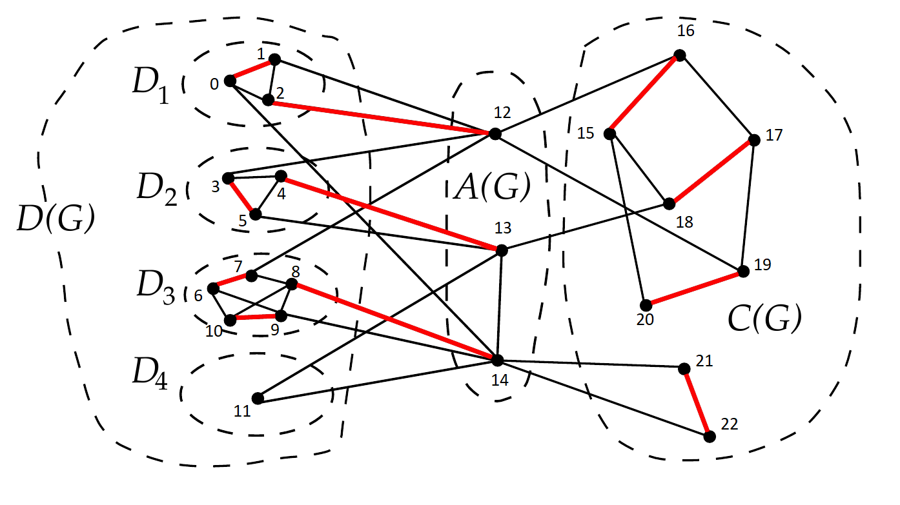

# Доклад "Структурная декомпозиция Галлаи-Эдмондса"
Директория содержит реализацию алгоритма декомпозиции графов на компоненты:
- **D(G)** - фактор-критические компоненты
- **A(G)** - соседи D(G)
- **C(G)** - остальные вершины

## Реализованные алгоритмы
1. Алгоритм Эдмондса для поиска максимального паросочетания
2. Декомпозиция Галлаи-Эдмондса

## Тест-кейс

Пример взят [отсюда](https://neerc.ifmo.ru/wiki/index.php?title=%D0%94%D0%B5%D0%BA%D0%BE%D0%BC%D0%BF%D0%BE%D0%B7%D0%B8%D1%86%D0%B8%D1%8F_%D0%AD%D0%B4%D0%BC%D0%BE%D0%BD%D0%B4%D1%81%D0%B0-%D0%93%D0%B0%D0%BB%D0%BB%D0%B0%D0%B8).
## Результаты выполнения
### Максимальное паросочетание
Найдено рёбер: 11

Покрыто вершин: 22 (из 23)

Рёбра найденного максимального паросочетания:

0 ↔ 1

2 ↔ 12

3 ↔ 4

5 ↔ 13

6 ↔ 7

8 ↔ 10

9 ↔ 14

15 ↔ 16

17 ↔ 18

19 ↔ 20

21 ↔ 22

### Декомпозиция компонент
| Компонент | Состав вершин       |Достоверность    |
|-----------|---------------------|-----------------|
| D(G)      | 0,1,2,...,11        | ✅ Верно        |
| A(G)      | 12,13,14            | ✅ Верно        |
| C(G)      | 15,16,...,22        | ✅ Верно        |

Программа отработала корректно.